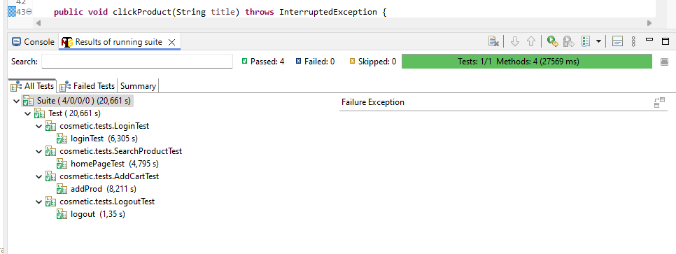

This site is a Tunisian reference for beauty and personal care products.

🧪 Automated Testing Project with Selenium and TestNG:

This project is a simple example of test automation for a website using Selenium WebDriver and TestNG. Its goal is to validate key functionalities of the application through automated test scenarios.

🔧 Technologies Used:

Java

Selenium WebDriver

TestNG

Maven (optional, if used for dependency management)

